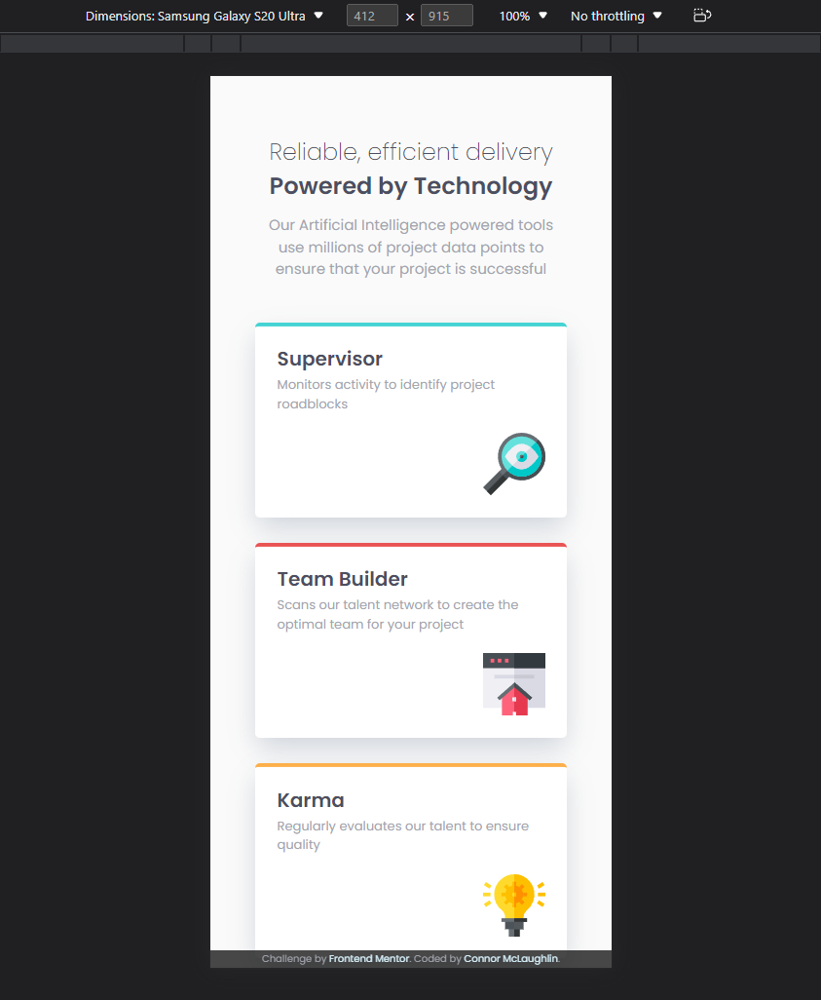

# Frontend Mentor - Four card feature section solution

This is a solution to the [Four card feature section challenge on Frontend Mentor](https://www.frontendmentor.io/challenges/four-card-feature-section-weK1eFYK). Frontend Mentor challenges help you improve your coding skills by building realistic projects. 

## Table of contents

- [Overview](#overview)
  - [The challenge](#the-challenge)
  - [Screenshot](#screenshot)
  - [Links](#links)
- [My process](#my-process)
  - [Built with](#built-with)
  - [Useful resources](#useful-resources)
- [Author](#author)

## Overview

### The challenge

Users should be able to:

- View the optimal layout for the site depending on their device's screen size

### Screenshot

#### Desktop

#### Mobile

### Links

- Solution URL: [GitHub Repo](https://github.com/CBMcLaughlin/FM-FourCards)
- Live Site URL: [GitHub Live Site](https://cbmclaughlin.github.io/FM-FourCards/)

## My process

### Built with

- Semantic HTML5 markup
- CSS custom properties
- Flexbox
- Mobile-first workflow

### Continued development

Use this section to outline areas that you want to continue focusing on in future projects. These could be concepts you're still not completely comfortable with or techniques you found useful that you want to refine and perfect.

**Note: Delete this note and the content within this section and replace with your own plans for continued development.**

### Useful resources

- [Box Shadow Generator](https://html-css-js.com/css/generator/box-shadow/) - This provided me a visual reference to set the box-shadow I desired on the card containers.

## Author

- Frontend Mentor - [@CBMcLaughlin](https://www.frontendmentor.io/profile/CBMcLaughlin)
- LinkedIn - [Connor McLaughlin](https://www.linkedin.com/in/connor-mclaughlin-3b89a4183/)

